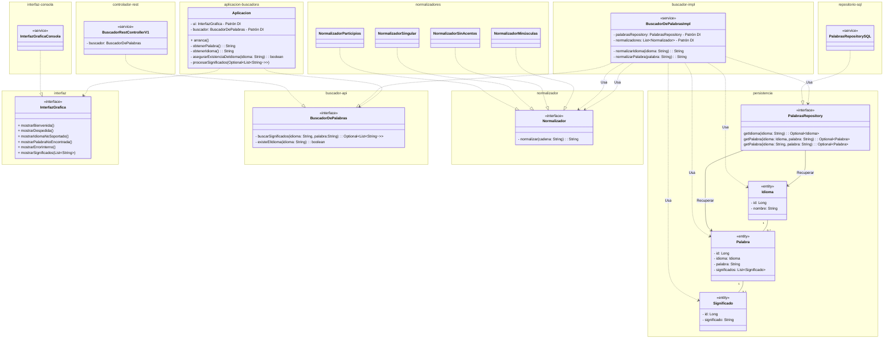

App para obtener las palabras y sus significados:
Dado un idioma y una palabra, mostrar al usuario los significados si es que existen.
Lo vamos a plantear:
- Las palabras a BBDD
- La interfaz será web (no la vamos a montar) JS (TS)
  - Montaremos una interfaz de consola (Spring Shell)
- No obstante lo dejaremos preparado para el poder montar una app web (Microservicios)

Por donde empiezo?
-> Montar el proyecto base Spring               ULTIMO! Spring es un DETALLE! podría hacerlo con .net.. u otros.

-> Modelar el sistema: UML (Unified Modeling Language). EN SERIO TIO... UML ... eso es un puto coñazo!!!
    -> Identificar dependencias
    -> Entidad-relación
        -> Mirar las entidades
        -> Repositorio de datos

-> PRUEBAS!
    No puedo ejecutarlas.. si no hay código!
    Pero si puedo definirlas!

---
# A modelar con UML... pero con truco!



# Grafico de componentes
```mermaid
graph TD
    A[Aplicacion] -->|usa| C[BuscadorDePalabras]
    E[InterfazGraficaConsola] -->|implementa| A
    D[BuscadorDePalabrasImpl] -->|implementa| C
    D -->|usa| F[PalabrasRepository]
    H[Normalizadores] <--|implementa| D

```


```java
class Aplicacion{
    private InterfazGrafica ui;
    private BuscadorDePalabras buscador;

    public static void main(String[] args) {
        Aplicacion app = new Aplicacion();
        app.arranca();
    }

    private arranca(){
        ui.mostrarBienvenida();
        try{
            String idioma = obtenerIdioma();
            if(asegurarExistenciaDeIdioma(idioma)){
                String palabra = obtenerPalabra();
                Optional<List<String>> significados = buscador.buscarSignificados(idioma, palabra);
                procesarSignificados(significados);
            }
        }catch(Exception e){
            ui.mostrarErrorInterno();
        }
        ui.mostrarDespedida();
    }

    private boolean asegurarExistenciaDeIdioma(String idioma){
        if(!buscador.existeElIdioma(idioma)){
            ui.mostrarIdiomaNoSoportado();
            return false;
        }
        return true;
    }

    private procesarSignificados(Optional<List<String>> significados){
        if(significados.isPresent()){
            ui.mostrarSignificados(significados.get());
        }else{
            ui.mostrarPalabraNoEncontrada();
        }
    }
}
```
---

# Mi app no va a ser un JAR

- Van a ser un puñado de JARs

       application.jar  > interfaz.jar
    -----------------------
     v   v     v        v
     v   v     v       interfaz-consola.jar > interfaz.jar
     v   v   repositorio-sql.jar    
     v   normalizadores.jar > normalizador.jar
     v
    buscador-implementacion.jar > normalizdor.jar
            v               v
        repository.jar     buscador.jar

Los paquetes que contengan implementaciones dependerán de paquetes que contengan APIs (porque si no, me cargo el principio de inversión de dependencias)
Los paquetes que contengan APIs dependerán de paquetes que contengan APIs
Y Habrá un paquete .. el de nivel superior: APLICACION, que dependerá de IMPLEMENTACIONES !


RepositorioMongoDB - repositorio-mongo.jar
    Proyecto nuevo -> repositorio.jar


Si meto normalizadores en la implementacion de mi buscador, Si el día de mañana quiero meter más normalizadores necesito recompilar el buscador.
Mientras que si está fuera, creo un nuevo proyecto: normalizadores-extendidos y añado el .jar a mi proyecto. Y no toco nada del código existente.


Porque no será porque en MAVEN no esté bien establecido el concepto de DEPENDENICA y el concepto de SUBMODULO.
Igual que en git tengo repos que pueden tener SUBMODULOS.

Y en git creo un repo global...
    Y para capa un repositorio concreto.
    Y todos estos repos los configuro como submodulos de mi repo global.

    git clone de todo el proyecto
    mvn package de todo el proyecto

    O

    git clone de un submodulo
    mvn package de un submodulo


En lugar de proyectos por capas de arquitectura... esto está guay
    Capa Exposición 
        - Implementación
    Capa negocio                Que tire la implementación y meta otra
        - API
        - Implementación
    Capa persistencia           Que tire BBDD y meta otra
        - API
        - Implementación

---

Empiezo por el proyecto normalizador -> normalizaador.jar
pom.xml... Que dependencias tiene este proyecto? NINGUNA

Y dentro tiene una triste interfaz. TENGO UN PUTO  PROYECTO PARA UNA INTERFAZ.. que alegría!
---
Por donde empiezo para este componente?

Creo la interfaz:

```java
public interface Normalizador {
    String normalizar(String cadena);
}
```

mvn install  y acabao el proyecto -> normalizador.jar
---

Implementaciones de normalizadores:
pom.xml -> Dependencia de normalizador.jar

Pruebas del componente!

```java

public class NormalizadorMinúsculasTest implements Normalizador {

    @Test
    public void testNormalizar(){
        // DADO
        String palabra= "HOLA";
        String resultadoEsperado = "hola";
        Normalizador normalizador = new NormalizadorMinúsculas();
        // CUANDO
        String resultado = normalizador.normalizar(palabra);
        // ENTONCES
        assertEquals(resultadoEsperado, resultado);
    }
}

public class NormalizadorSinAcentosTest implements Normalizador {

    @Test
    public void testNormalizar(){
        // DADO
        String palabra= "ÁÉÍÓÚ";
        String resultadoEsperado = "AEIOU";
        Normalizador normalizador = new NormalizadorSinAcentos();
        // CUANDO
        String resultado = normalizador.normalizar(palabra);
        // ENTONCES
        assertEquals(resultadoEsperado, resultado);
    }
}

public class NormalizadorSingularTest implements Normalizador {

    @Test
    public void testNormalizar(){
        // DADO
        String palabra= "perros";
        String resultadoEsperado = "perro";
        Normalizador normalizador = new NormalizadorSingular();
        // CUANDO
        String resultado = normalizador.normalizar(palabra);
        // ENTONCES
        assertEquals(resultadoEsperado, resultado);
    }
    
    @Test
    public void testNormalizar(){
        // DADO
        String palabra= "melones";
        String resultadoEsperado = "melon";
        Normalizador normalizador = new NormalizadorSingular();
        // CUANDO
        String resultado = normalizador.normalizar(palabra);
        // ENTONCES
        assertEquals(resultadoEsperado, resultado);
    }
}


// CODIGO

public class NormalizadorMinúsculas implements Normalizador {
    @Override
    public String normalizar(String cadena) {
        return cadena.toLowerCase();
    }
}

public class NormalizadorSinAcentos implements Normalizador {
    @Override
    public String normalizar(String cadena) {
        return cadena.replaceAll("[áéíóúÁÉÍÓÚ]", "aeiouAEIOU");
    }
}

public class NormalizadorSingular implements Normalizador {
    @Override
    public String normalizar(String cadena) {
        if(cadena.endsWith("es")){
            return cadena.substring(0, cadena.length()-2);
        } else if(cadena.endsWith("s")){
            return cadena.substring(0, cadena.length()-1);
        }

        return cadena;
    }
}

mvn install y acabao el proyecto -> normalizadores.jar

```


CUIDAO: ESTO TIENE SENTIDO EN proyectos medios/grandes que está previsto que tengan un ciclo de vida largo.

Si estoy montando un proyecto de mierda... con pocas cosas.. para un pendejo... por las noches para lanzar un trabajo este mes... no tiene sentido.

lombok